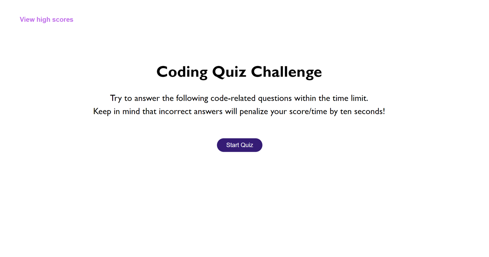
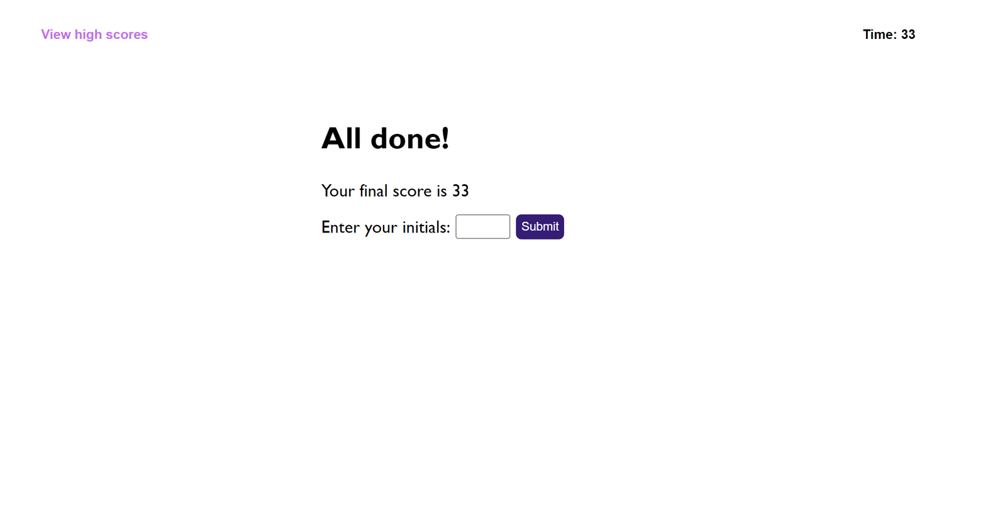
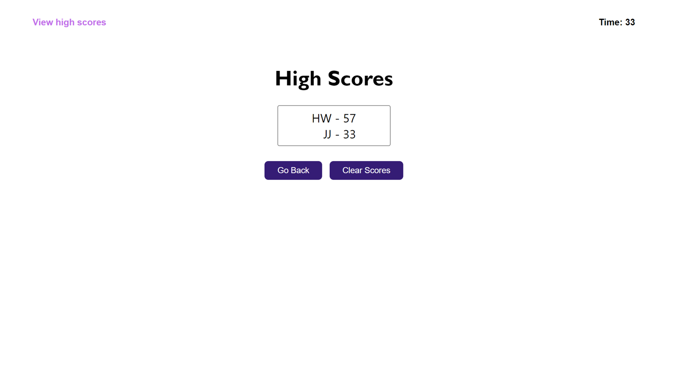

# Multiple-Choice-JS-Coding-Quiz

## Description
This project is a multiple choice quiz covering JavaScript. After clicking on the "Start Quiz" button, users are presented with 10 multiple choice questions to answer within 75 seconds. Each wrong answer will cause the available time to drop by 10 seconds. Once the quiz is over, users enter their initials and are presented with the high score screen that catalogs all past scores.

## Visuals
The following images show the start page, the score page, and the high scores page.

## Installation
1. Clone the repository to your machine
2. Copy the files to your own repository
3. Conduct the git add, commit, and push commands to update your repository with the copied files
4. Modify the code to meet your needs
5. Commit and push your changes

## Links
- [Deployed Website](https://hwoolford.github.io/multiple-choice-js-coding-quiz/)

- [GitHub Repository](https://github.com/hwoolford/multiple-choice-js-coding-quiz)

## Resources and Acknowledgments
- [Javascript, how to register click events for multiple buttons with same class](https://www.youtube.com/watch?v=Za4-APtd_l4)

- I would like to acknowledge the assistance provided by Xpert, an AI Learning Assistant, in providing guidance and support throughout the development of this project. Xpert's insights and suggestions were invaluable in helping me overcome challenges and improve the quality of my work. (Acknowledgement written by Xpert)